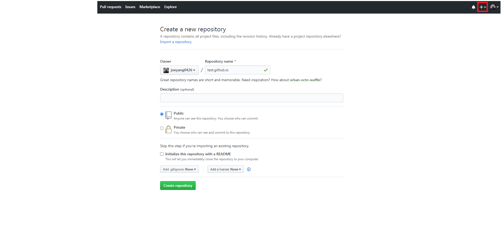
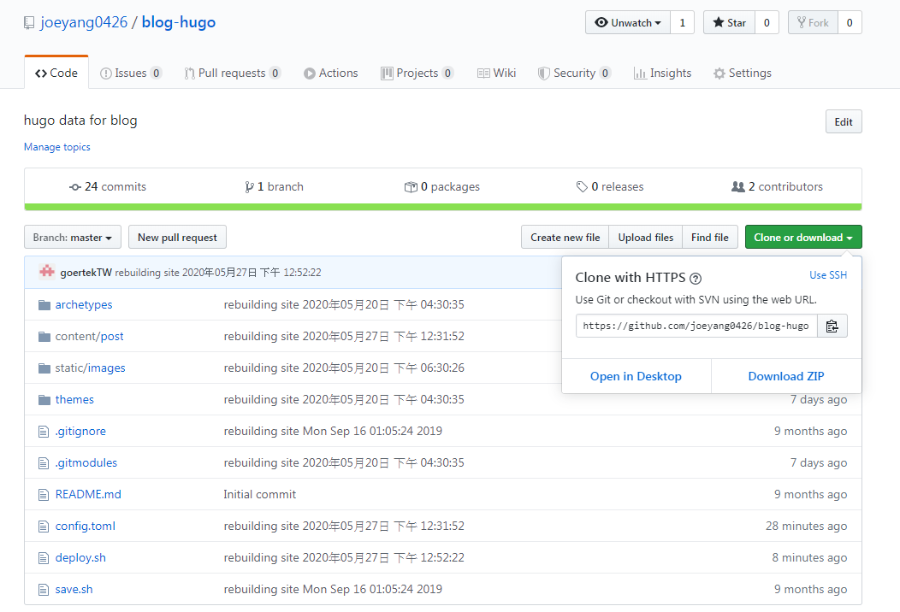

<!--more-->
今天談到有關HUGO網站託管的部份，先必需在github建立一個repository，

當然如果沒有[github]就趕快去申請一個吧，進去github後點右上角，

在repository name 填上`username`.github.io，

username的部份是要自行填入想要建立的帳戶名，圖中是用test做為範例，

同時也要多建立一個repository放入hugo專案內容，

這個是我建立的repository[blog-hugo]。



要使用repository之前，需要先使用git clone，這樣就不用做一些init和remote的動作了，

這個就不多說了，直接上cmd如下列。

這個指令建立在外層，記錄專案的內容，而網址就去github中取得，如下圖
```
git clone https://github.com/joeyang0426/blog-hugo.git
```


這個指令是記錄hugo生成的網站內容
```
git clone https://github.com/joeyang0426/joeyang0426.github.io.git
```

接下來就是建立hugo網頁放入repository，下列是HUGO專案主要內容，

這些除了public，都可以放在專案repository(blog-hugo)，

專案是用`hugo new site`產生，public是完成後由`hugo`產生的內容，

到時候需要push到網站的repository(username.github.io)。

```
.
├── archetypes/
├── content/
├── data/
├── layouts/
├── public/
├── static/
├── themes/
└── config.toml
```

我是用最簡易的script管理網站內容，是由[HUGO教學網站]提供，

裡面有很多教學，之後有機再來介紹。

下面是pushSource.sh的內容，只是單純利用git和script的工具存放在github，

前一篇有介紹過[git的工具]，可以自行下載使用。

```
#!/bin/bash

# Add changes to git.
git add -A

# Commit changes.
msg="rebuilding site `date`"
if [ $# -eq 1 ]
  then msg="$1"
fi
git commit -m "$msg"

# Push source and build repos.
git push origin master
```

下面是deploy.sh的內容，它會用hugo生成的網站內容，再將內容部署到github。

```
#!/bin/bash

echo -e "\033[0;32mDeploying updates to GitHub...\033[0m"

# remove all files.
rm -f public/*
cd joeyang0426.github.io
git rm -r .
cd ..

# Build the project.
hugo # if using a theme, replace by `hugo -t <yourtheme>`

cp -av public/* joeyang0426.github.io/

cd joeyang0426.github.io

# Add changes to git.
git add -A

# Commit changes.
msg="rebuilding site `date`"
if [ $# -eq 1 ]
  then msg="$1"
fi
git commit -m "$msg"

# Push source and build repos.
git push origin master

# Come Back
cd ..
```

完成上列動作後，之後新增文章內到content/post的時候，或更改網頁，

只要輕鬆的點pushSource.sh和deploy.sh，就會記錄專案內容且上傳網站了。


[HUGO教學網站]:https://gohugo.io/documentation/
[git的工具]:https://github.com/gohugoio/hugo/releases
[github]:https://github.com/
[blog-hugo]:https://github.com/joeyang0426/blog-hugo
