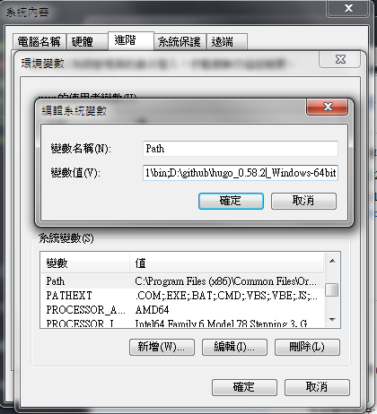
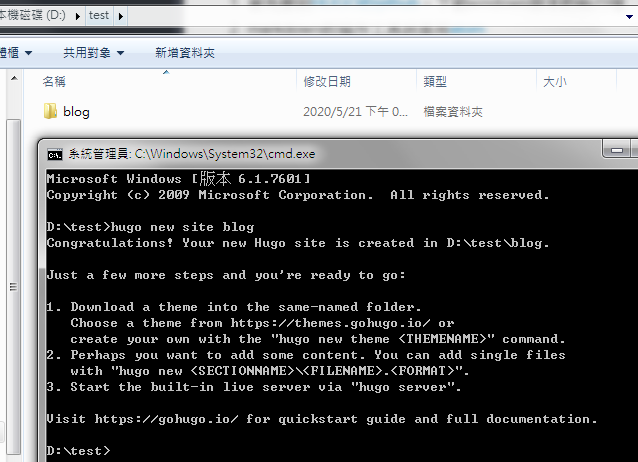
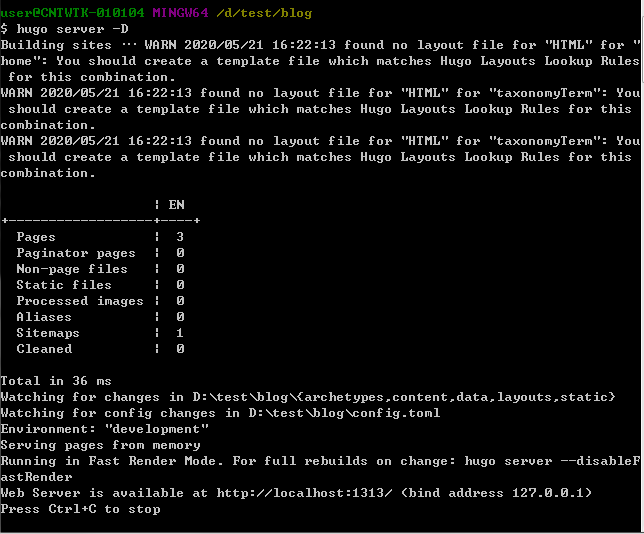

<!--more-->
第一次試著用blog記錄自己的生活，一開始本來想用一般的網站，但是感覺廣告很多，

想說試用靜態網站而且又不用錢，但是俗話說的好免費是最貴的，

我花了很多心力又對頁面東挑西撿，搞了很久也看到了一堆用靜態網站的廢站，

就知道其實一直有更新blog是不容易的，用靜態網站(HUGO)優缺點如下:

## 優點
- 生成快，讀取速度很快，這個可能要頁數很多才有感覺
- 一站到底，不用搞CMS、資料庫的東西
- 可以使用免費的github，零成本

## 缺點
- 上手有點困難，就算是工程師的身份，也要花一段時間
- 維護麻煩，沒有限制的反面就是什麼都要自己來
- 需要一直學習一些網頁知識，才能能力修改blog
---
## HUGO BLOG建構過程 - 1
以下是windows版本的流程，下面是準備工具
1. 首先要到[HUGO的github]，下載windows版本的執行檔
2. markdown的寫作工具我是用[atom]
3. 下載windows版本的[Git]

先安裝git照default設定就好，接著HUGO 設定流程，
將windows解壓縮後，放在固定位置，然後到環境變數設定路徑

如下圖所示:



設定一個新的檔案夾，在路徑位置直接打cmd後，開啟命令提示字元
```
hugo new site blog
```



開始下載一個theme，快速建立一個可以寫作的網站，之後有機會再來講內容
```
git clone https://github.com/kakawait/hugo-tranquilpeak-theme.git ./theme/hugo-tranquilpeak-theme
```
再將下列文件移至相對應的位置
- `exampleSite/content/post`->`blog/content`
- `exampleSite/config.toml`->`blog/`

最後再執行hugo建立在地端的網站，再到`http://localhost:1313/`確認內容
```
hugo server -D
```


待續...

[HUGO的github]:https://github.com/gohugoio/hugo/releases
[atom]:https://atom.io/
[Git]:https://git-scm.com/download/win
